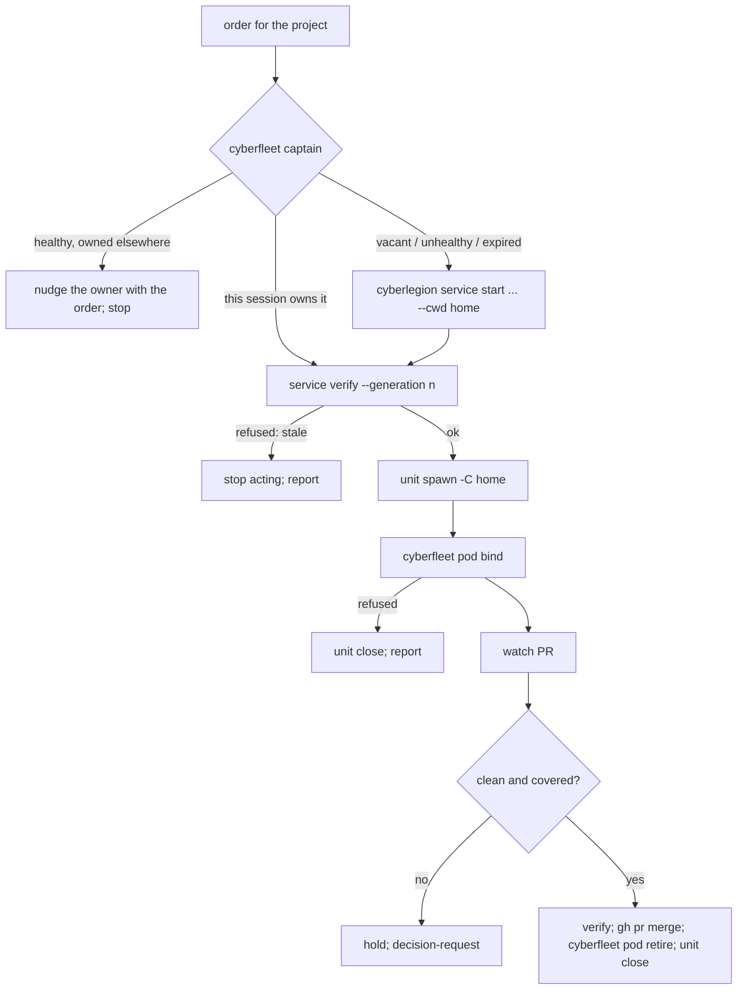

# captain — the project's resident persona

**Captain** is the resident automaton of one project — one **ship**, in ADR-0023's vocabulary. There
is exactly one authoritative Captain per project: cyberlegion's `captain` project service, whose lease
is fenced by a **generation** (cyberlegion ADR-0033). The Captain is based in the project's default
checkout (its **home**), owns the project's **sorties**, spawns the **Pods** that carry them into
their own worktrees, merges their clean work in order, and retires each Pod exactly once. It ships
from `packages/cyberfleet/skills/captain`; the unattended realization is the `headless-operator`
agent, which runs the same duties as one lifecycle tick under the same lease.

This node lands the **ownership half** of cyberfleet#25 (ADR-0023, amendment of 2026-10-06). The mail
half — reports in a mission's work channel, retiring the standing `operator` mailbox — is
cyberfleet#92 and is not specified here: until it lands, a Pod reports by cyberlegion mail to the
handle its brief names, which is its Captain's.

## What

- **One Captain, contacted or started, never replaced by a caller.** `cyberlegion service start
  <project> captain --cwd <home>` resolves the healthy owner or launches exactly one. A session that is
  not the owner hands its order to the Captain and takes nothing over.
- **Authority is the lease, checked before every act.** Claims, merges, Pod records, and retirements
  run behind `cyberlegion service verify --generation <n>`. A Captain replaced by a newer generation is
  refused and stops.
- **Every Pod has exactly one owning Captain, recorded and fenced.** `cyberfleet pod bind` records it
  at the Captain's generation, inside cyberlegion's `withOwnership`, and only for a Pod in its own
  worktree of this project — not in the home, not in another project.
- **Recovery is explicit and visible.** `cyberfleet pods` shows each Pod's owner state: `current`,
  `unavailable` (the Captain's session is gone but it still holds the lease), `orphaned` (a newer
  generation replaced its owner), or `retired`. A restart of the same Captain keeps its Pods; only
  `cyberfleet pod adopt` by the current Captain moves an orphan.
- **Retirement happens once.** `cyberfleet pod retire` is fenced like `bind`, and a second retire is
  refused, so an interactive Captain and a headless tick cannot both retire a Pod.
- **The project key is opaque.** cyberfleet stores the key cyberlegion resolved and never parses it
  (cross-package decision 0004).

## Use Cases

**Fit:** strong — activation is a real routing decision (work on this project, versus inside a Pod,
versus another project's Captain), and the Captain carries judgment: when to start, what goes in a
brief, whether a pull request is clean, whether an orphan can be adopted. All four eval layers carry
signal. The ownership record itself is deterministic and is verified by unit tests on the CLI.

| Actor | Goal |
| --- | --- |
| **Council** | put work on a project and get it merged, without hunting for panes |
| **Operator, or another project's Captain** | hand an order to this project's Captain without taking it over |
| **Captain** | spawn, watch, merge, and retire its project's Pods, and only while it holds the lease |
| **headless-operator** | run one lifecycle tick for the project when no Council is present, under the same lease |

**UC1 — contact or start.** The Captain is vacant or unhealthy: start it in its home. It is healthy
and owned by another session: hand that session the order. Two callers at once: one launch.

**UC2 — dispatch a Pod.** Spawn it from the home into its own worktree, bind it, brief it with this
Captain's handle as the return address.

**UC3 — merge and retire.** Gate the pull request on the clean bar, verify the lease, merge, retire
the Pod through the fenced record, then close its unit.

**UC4 — recover.** The Captain's session died: restart it, keeping its generation and Pods. A newer
Captain took the lease: it adopts each orphan it can still control, and reports the rest.

## Control Flow

## Scenario map

| Use case | Scenarios |
| --- | --- |
| UC1 | `a vacant project starts one Captain in its home` · `a healthy Captain is contacted, never replaced` · `concurrent starts launch one Captain` |
| UC1 | `the home is never switched or edited` |
| UC2 | `every Pod is spawned into its own worktree and bound to one Captain` · `a Pod in the home or another project is refused` · `the brief names the Captain's own handle` |
| UC3 | `a stale Captain cannot merge, record, or retire` · `a Pod is retired once` · `a relayed order carries no Council approval` |
| UC4 | `unavailable and orphaned Pods stay visible` · `a restarted Captain keeps its Pods` · `an orphan moves only by explicit adoption` · `an orphan with no working control is reported, not adopted` |
| headless | `a headless tick dispatches only under the lease` |
